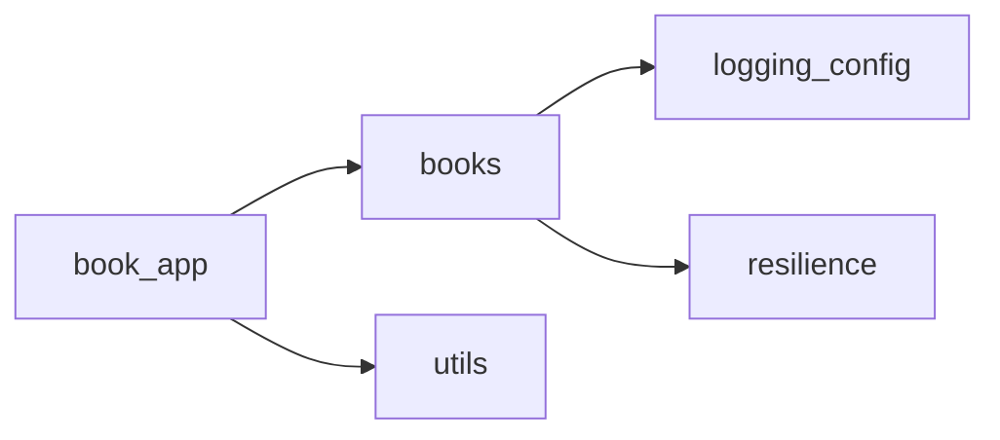

# Architecture — book-app-project

> Auto-generated by `npm run gen:arch` (.github/scripts/gen-arch-diagram.js).
> Re-run after changing any Python module in `samples/book-app-project/` to refresh.
>
> Last generated: 2026-05-06T09:23:11.246Z
> Diagram hash: `9244e2a554f7`

## Module Map

| File | Lines | Purpose | Imports |
|---|---|---|---|
| `book_app.py` | 86 | CLI entry point — interactive menu, delegates to `BookCollection` and `utils` | `books`, `utils` |
| `books.py` | 115 | Core domain — `Book` dataclass, `BookCollection` CRUD + JSON persistence | `logging_config`, `resilience` |
| `logging_config.py` | 66 | Observability — `JSONFormatter`, `get_logger()`, stderr-only structured logging | — |
| `resilience.py` | 85 | Resilience — `retry_with_backoff` decorator factory, exponential backoff for I/O | — |
| `utils.py` | 71 | UI helpers — menu display, `parse_year()`, `show_books()`, feature flag `BOOK_APP_STRICT_YEAR` | — |

## Dependency Graph



## Change Summary (vs previous run)

```
1 change(s) since 2026-05-06T09:23:01.195Z:
  ~ CHANGED: books.py (lines -1)
```

## Refresh Instructions

```bash
# From repo root:
npm run gen:arch

# Verify the diagram hash changed after a module edit:
cat ai-track-docs/.arch-manifest.json | python3 -m json.tool | grep diagramHash
```

## Rollback

To remove the generated artifacts:
```bash
rm ai-track-docs/architecture.md ai-track-docs/.arch-manifest.json
```
