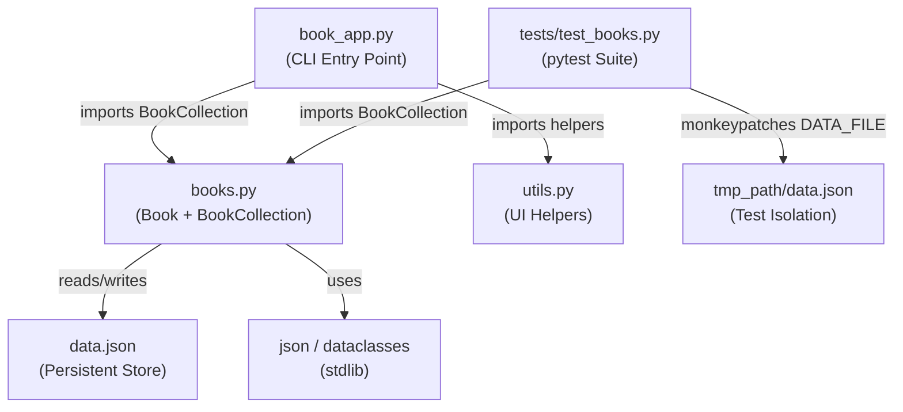
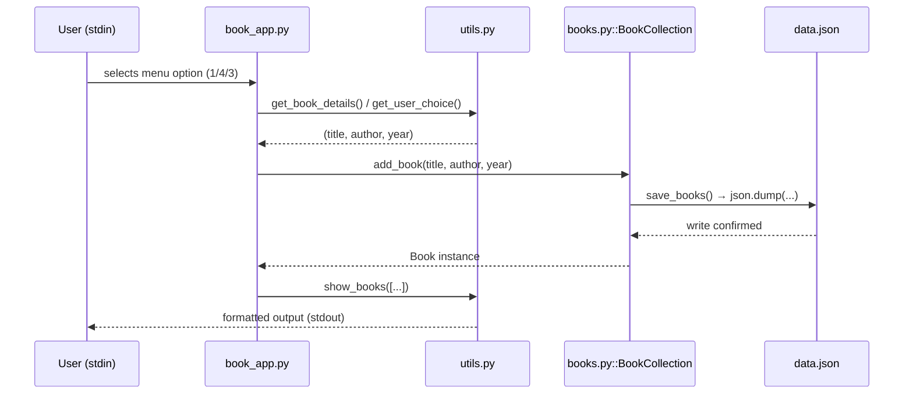
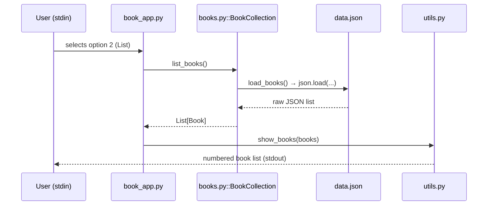
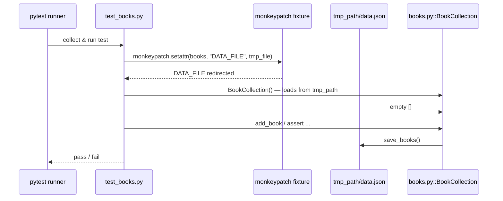
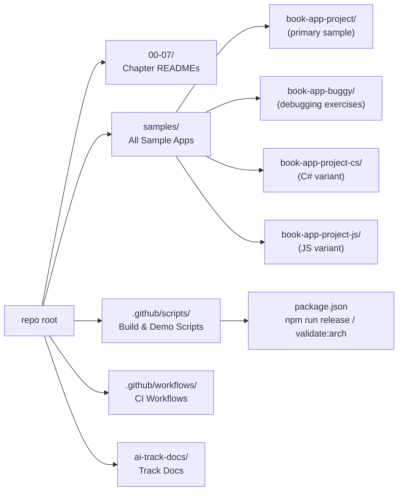

# Architecture — Book App Project

This document maps the conceptual architecture of the primary course sample
(`samples/book-app-project/`) to real file paths in the repository.

---

## Module Map

| Conceptual Role | Real File Path |
|---|---|
| CLI Entry Point | `samples/book-app-project/book_app.py` |
| Domain Model + Collection | `samples/book-app-project/books.py` |
| UI Helpers | `samples/book-app-project/utils.py` |
| Persistent Store | `samples/book-app-project/data.json` |
| Test Suite | `samples/book-app-project/tests/test_books.py` |
| Project Config | `samples/book-app-project/pyproject.toml` |

---

## Dependency Graph

---

## Data Flows

### Flow 1 — User writes a book (Add/Remove/Mark-Read)

### Flow 2 — User reads the collection (List)

### Flow 3 — Test isolation (pytest)

---

## Course-Level Structure

